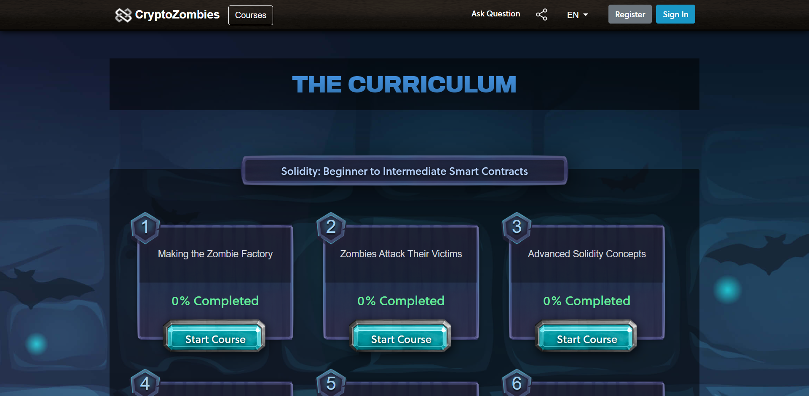

## 1. Solidity の学習

Solidityは、Ethereumのスマートコントラクト言語です。スマートコントラクトは、ブロックチェーン上で実行される自己実行型のコードで、契約の自動実行を可能にします。Solidityは、スマートコントラクトの開発に必要な言語機能を提供し、Ethereum上で動作するDApps（分散型アプリケーション）の開発に使用されます。そのためAuditをするにあたって、Solidityを学ぶことは必須です。  

ここではSolidityを学ぶ上で役立つ教材をピックアップして紹介します。  

全て無料で学習できます。

### 🧟 [CryptoZombies](https://cryptozombies.io/en/course/)

CryptoZombiesは、ブロックチェーンとSolidityプログラミング言語を学ぶためのオンライン学習プラットフォームです。プログラミングをゲーム感覚で学べることが特徴で、ゾンビのトークンを作成しながら、Solidity言語の基礎から高度な概念まで学ぶことができます。CryptoZombiesは、ブロックチェーン開発者を目指す人々にとって、スキルを磨くための素晴らしい学習ツールです。  

### 🤖 [Solidity by Example](https://solidity-by-example.org/)

Solidity by Exampleは、Solidity言語の基本的な概念を理解するためのオンラインリソースです。スマートコントラクトの開発に必要な、データ型、条件分岐、ループ、関数、イベント、オブジェクト指向プログラミングなどを、簡単なサンプルコードを通じて学ぶことができます。  

Solidityを学びたい初心者にとっては、入門から応用までカバーするこのリソースが非常に有用です。また、Solidityのコーディング例を提供するためのリファレンスとしても役立ちます。

### ♦️ [Mastering Ethereum](https://cypherpunks-core.github.io/ethereumbook/)

『Mastering Ethereum』は、Ethereumブロックチェーンの技術的な理解を深めるための書籍です。Ethereumの設計思想、スマートコントラクトの開発、トランザクション、マイニング、セキュリティ、拡張性などについて詳しく説明されています。

Ethereumの内部構造やプロトコルについての理解を深め、Ethereumネットワークをより効果的に活用するために役立ちます。この本は、ブロックチェーン開発者、エンジニア、学習者にとって、Ethereumの高度なトピックを学ぶための優れたリソースです。

### 🐍 [FreeCodeCamp's 16-Hour Course (Python and Brownie Framework)](https://www.youtube.com/watch?v=M576WGiDBdQ)

FreeCodeCampの16時間コースは、PythonとBrownieフレームワークを使ってスマートコントラクトを開発する方法を学ぶためのオンラインコースです。

ブロックチェーンの基本を理解し、Solidityスマートコントラクトの開発に必要なPythonプログラミングスキルを身につけます。コースでは、Brownieフレームワークを使用してスマートコントラクトをテスト、デプロイ、デバッグする方法も学ぶことができます。

このコースは、初心者にとっては手頃な時間枠でスキルアップするための素晴らしいリソースです。

### 🦏 [FreeCodeCamp's 32-Hour Course (JavaScript and Hardhat Framework)](https://www.youtube.com/watch?v=gyMwXuJrbJQ)

FreeCodeCampの32時間コースは、JavaScriptとHardhatフレームワークを使ってスマートコントラクトを開発する方法を学ぶためのオンラインコースです。

JavaScriptとSolidityの基礎を理解し、Hardhatフレームワークを使用してスマートコントラクトのテスト、デプロイ、デバッグ方法を学ぶことができます。また、Web3.jsやReact.jsを使用して、フロントエンドとブロックチェーンを接続する方法についても学ぶことができます。

このコースは、JavaScriptを使ったスマートコントラクトの開発を学びたい人々にとって、非常に役立つリソースです。
