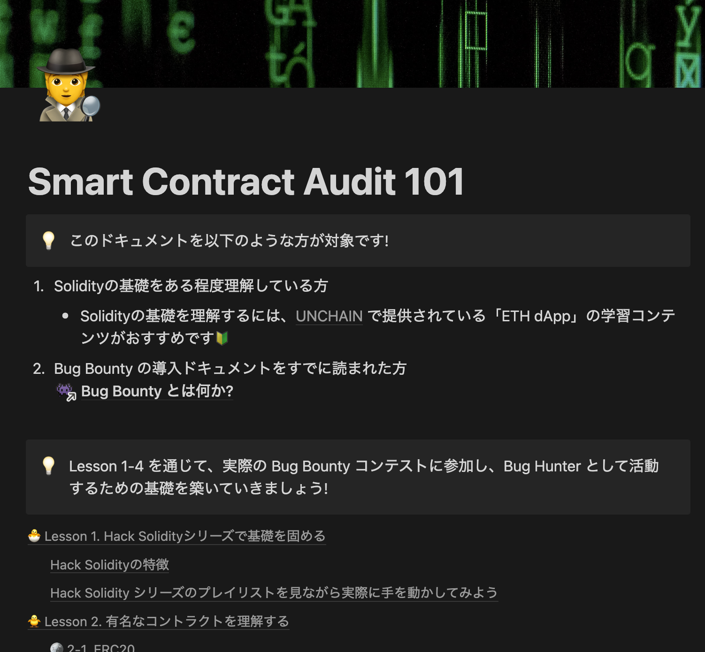
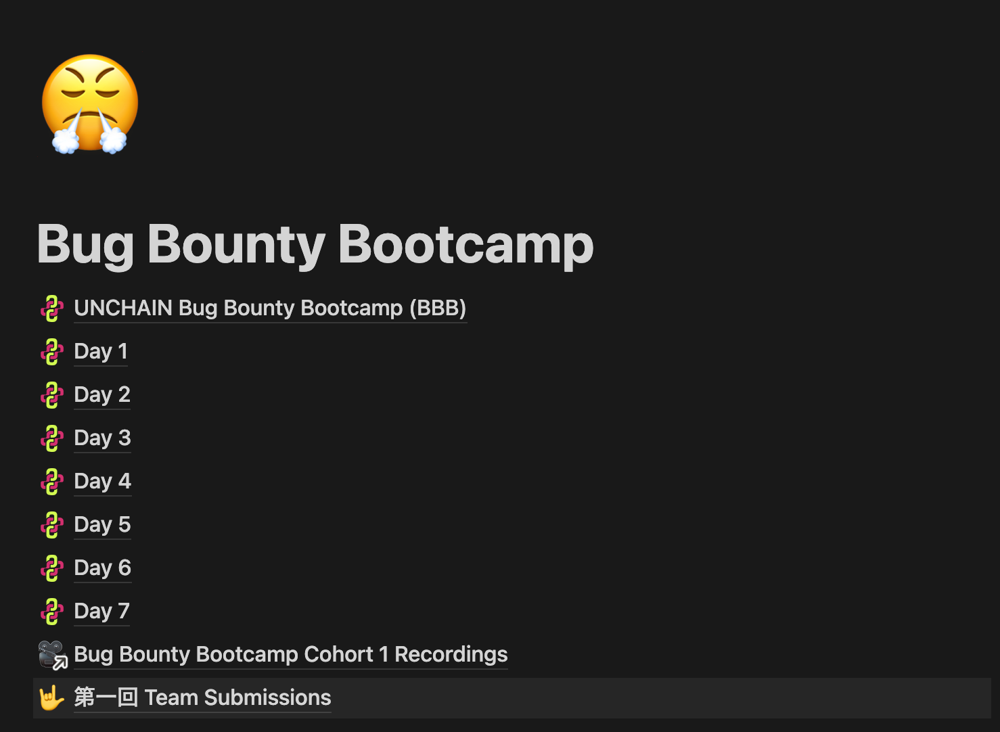
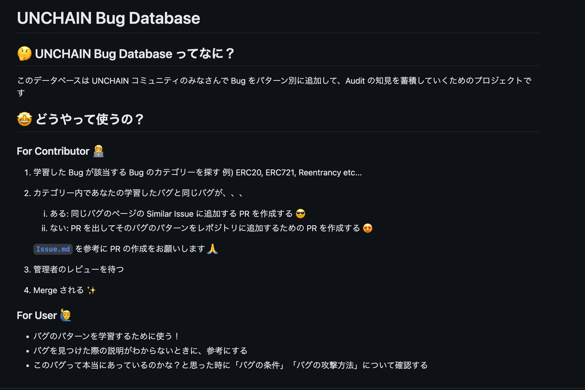
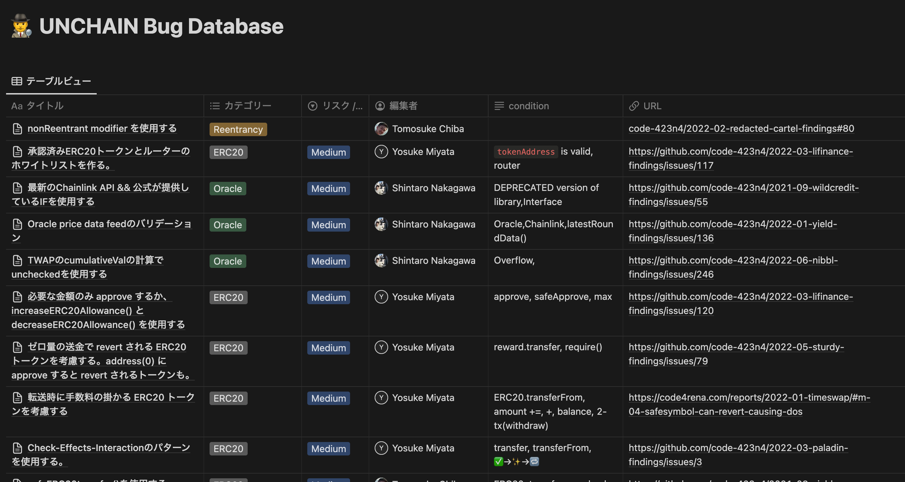
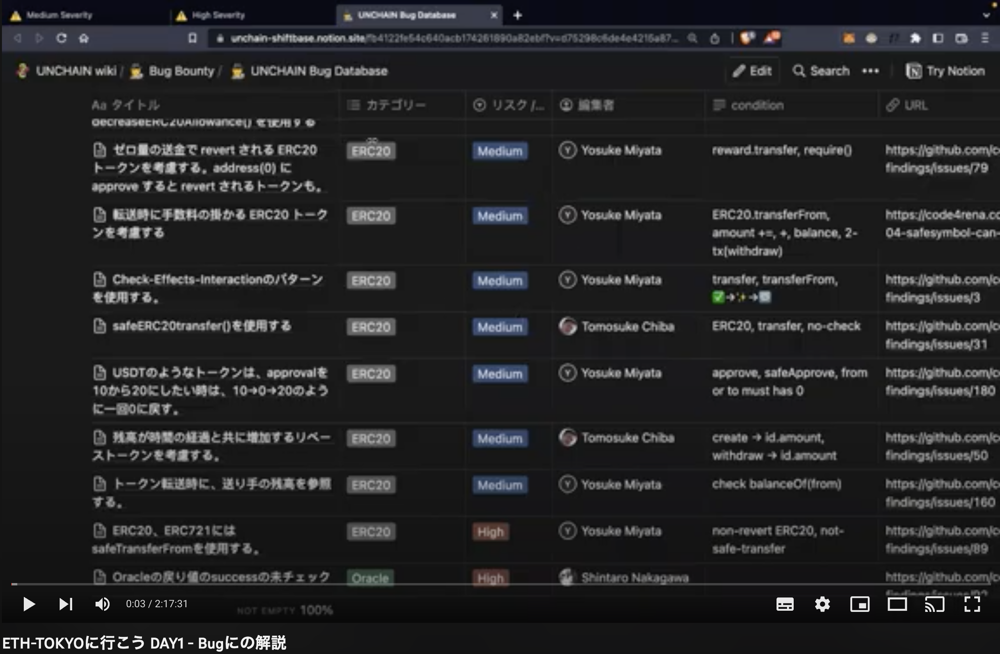

## UNCHAIN コンテンツ

### STEP① | そもそも…

#### Bug Bounty とは何か?

https://unchain-shiftbase.notion.site/Bug-Bounty-42ec4d16f0c143debd13d70cb2ee95ac

### STEP② | Auditorになるためのロードマップ

#### Smart Contract Audit 101 【初心者向け】

https://unchain-shiftbase.notion.site/Smart-Contract-Audit-101-cfd8da4758044d93b6e361d79872f4d4

### STEP③ | ブートキャンプ

#### Bug Bounty Bootcamp【中級者向け】

https://unchain-shiftbase.notion.site/Bug-Bounty-Bootcamp-c8ecad89550146468f9b17862e254a54

### STEP④ | バグ Example

#### 各カテゴリーの有名なバグの例がこちら

https://github.com/unchain-tech/openzeppelin-deepdive/tree/main/bugs

### STEP⑤ | バグDB

#### UNCHAIN Bug Database

https://unchain-shiftbase.notion.site/fb4122fe54c640acb174261890a82ebf?v=d75298c6de4e4215a877f4096b93c760

### STEP⑥ | バグDB解説

#### 解説❶

[learn more ...](https://youtu.be/vT_f7czIDx0)

#### 解説❷

[learn more ...](https://youtu.be/_bVP31TaXU4)